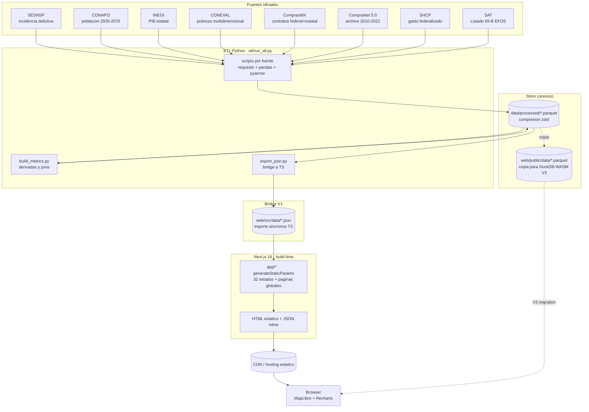
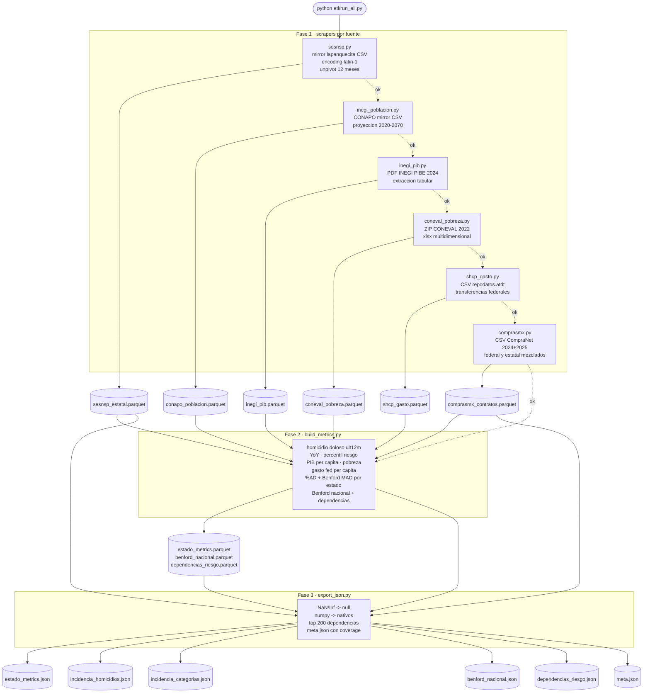
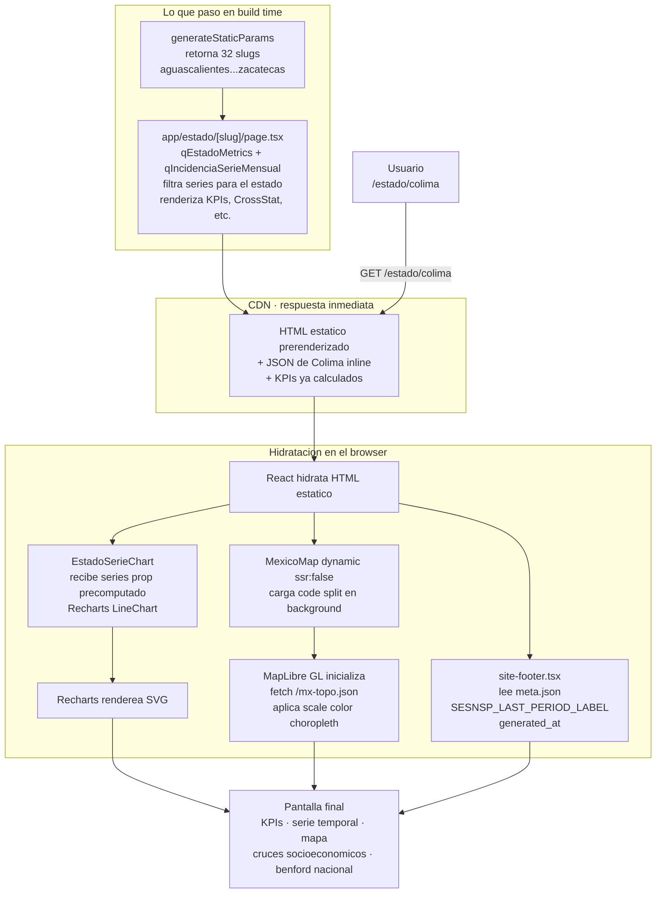

# Arquitectura · México Bajo Lupa

Documentación técnica de cómo viajan los datos desde fuentes oficiales hasta el navegador del usuario, y cómo se compone la aplicación. Stack actual: **Next.js 16** (App Router, build estático), **Tailwind v4**, **MapLibre GL** para choropleths, **Recharts** para series, y **Python + pandas** para el ETL. Base instalada: **7 fuentes oficiales** (SESNSP, CONAPO, INEGI, CONEVAL, ComprasMX, SHCP, SAT 69-B), **2.36M contratos** del archivo histórico CompraNet 5.0, **7 métricas activas** en el mapa, **32 estados** prerenderizados, **200+ dependencias federales** analizadas con Benford.

> Convención clave del proyecto: **Parquet es el almacén canónico**, **JSON es el bridge de build** que se importa sincrónicamente en TypeScript. Toda la app es **estática**: no hay servidor de aplicación corriendo en producción.

---

## Diagrama 1 · Arquitectura general

Mapa de extremo a extremo: cómo un dato federal o estatal termina pintando un polígono en el navegador. Hay una sola dirección de flujo (fuentes → ETL → store canónico → bridge JSON → build → CDN → browser) y ningún componente intermedio se ejecuta on-demand: lo que ve el usuario fue precomputado en build time. La capa DuckDB-WASM aparece punteada porque está prevista como camino de migración cuando el JSON sincrónico ya no escale (~5 MB).

> El pipeline de ML no supervisado (`ml/scripts/*`) consume los mismos parquets canónicos y produce un segundo bridge a `web/src/data/ml/*.json`. Ver **Diagrama 5** abajo para los detalles. La sección `/ml` del sitio consume esos JSONs igual que el resto del frontend.



**Si se rompe X**:
- Si una **fuente oficial** cambia URL o esquema, solo falla su script (`etl/<fuente>.py`); los Parquet existentes siguen sirviendo a la web hasta el siguiente build. La app nunca se cae por una fuente caida.
- Si **export_json.py** falla, el bundle de Next.js sigue compilando con el último JSON commiteado en `web/src/data/`. La web queda con datos viejos pero **funciona**.
- Si **el build de Next.js falla**, el CDN sigue sirviendo la versión anterior. No hay servidor que se "caiga": una falla de build solo bloquea el deploy.
- DuckDB-WASM aún no está cableado en runtime; los Parquet en `web/public/data/` se publican preventivamente para cuando llegue V3.

---

## Diagrama 2 · ETL pipeline

`etl/run_all.py` orquesta los pasos en **orden de dependencias**: primero las fuentes crudas (SESNSP, CONAPO, INEGI, CONEVAL, SHCP, ComprasMX federal+estatal, CompraNet 5.0 histórico, SAT 69-B), después los builders derivados (`build_metrics.py` cruza por `cve_ent`; `build_historico_metrics.py` agrega por año y sexenio; `build_efos_metrics.py` cruza SAT × ComprasMX por RFC; `build_continuidad.py` evalúa persistencia de proveedores entre sexenios), y al final `export_json.py` que escupe el bridge para TypeScript. Cada script es un módulo Python independiente, importable y corrible suelto (`python etl/sesnsp.py`).



**Si se rompe X**:
- Si **un scraper de fuente individual falla** (404, esquema cambiado, timeout), `run_all.py` loguea el `traceback` y corta el pipeline (`return`, no `raise`). El estado intermedio en disco queda intacto: si SHCP cae pero SESNSP ya escribió su Parquet, ese Parquet se queda. Reanudar es correr el script suelto y volver a llamar `run_all.py`.
- Si **build_metrics.py** falla porque falta un Parquet upstream, `SystemExit` con mensaje explícito ("Falta X. Corre primero: python etl/X.py"). Las fuentes opcionales (PIB, pobreza, SHCP, ComprasMX) están envueltas en `if path.exists()` — si faltan, las columnas correspondientes quedan `pd.NA` y el resto se computa igual.
- Si **export_json.py** falla en serializar (NaN, tipo numpy raro), tira `ValueError` por `allow_nan=False`. La sanitización con `_clean()` cubre la mayoría de casos; cuando crashea es señal de que entró un tipo nuevo y hay que ampliar `_clean`.

---

## Diagrama 3 · Flujo de extracción de un dato · ejemplo SESNSP

Trazabilidad punto a punto del dato "homicidios dolosos" para un estado: desde el mirror de GitHub que sigue al CSV oficial de SESNSP, hasta el polígono coloreado en el choropleth. Cada flecha implica una transformación o un cambio de formato, y cada nodo deja un artefacto persistente que se puede inspeccionar a mano.

```mermaid
flowchart TD
    Origen["raw.githubusercontent.com/<br/>lapanquecita/incidencia-delictiva<br/>main/data/estatal.csv<br/>mirror oficial SESNSP"]

    subgraph Sesnsp["etl/sesnsp.py"]
        Fetch[http_download<br/>requests + cache local]
        Read[pd.read_csv<br/>encoding latin-1 / utf-8 / cp1252]
        Trans["transform()<br/>coalesce_columns para Anio/Entidad/<br/>Tipo/Subtipo/12 meses<br/>melt() unpivot meses<br/>to_cve_ent normaliza nombre -> 01..32<br/>filtra subtipo Homicidio doloso"]
    end

    Raw[(data/raw/<br/>sesnsp_estatal_v0.csv<br/>~50 MB latin-1)]
    ProcParquet[(data/processed/<br/>sesnsp_estatal.parquet<br/>schema long: cve_ent, ano, mes,<br/>tipo_delito, subtipo, total)]

    subgraph Build["etl/build_metrics.py"]
        Filtro[filter subtipo Homicidio doloso]
        Agg["assign(ym = ano*12 + mes)<br/>last12m vs prev12m<br/>tasa /100k = total / poblacion * 1e5<br/>cambio_yoy = delta %<br/>riesgo = rank percentil"]
    end

    EstParquet[(data/processed/<br/>estado_metrics.parquet)]

    subgraph Export["etl/export_json.py"]
        Sanit[NaN -> null<br/>numpy -> nativos]
    end

    JSON[(web/src/data/<br/>estado_metrics.json<br/>32 filas)]

    subgraph Web["Next.js · build time"]
        Query["lib/queries.ts · qEstadoMetrics()<br/>import sincrono del JSON<br/>map a EstadoMetrics tipado"]
        MapaPage[app/mapa/page.tsx<br/>renderiza MapaExplorer]
        Mapa[components/mapa-explorer.tsx<br/>dynamic import MexicoMap ssr:false]
        Mexico[components/mexico-map.tsx<br/>MapLibre + TopoJSON<br/>color = scale homicidios_100k]
    end

    Topo[(public/mx-topo.json<br/>geometrias 32 estados)]
    User[Usuario ve choropleth<br/>hover -> tooltip por estado]

    Origen --> Fetch
    Fetch --> Raw
    Raw --> Read
    Read --> Trans
    Trans --> ProcParquet

    ProcParquet --> Filtro
    Filtro --> Agg
    Agg --> EstParquet

    EstParquet --> Sanit
    Sanit --> JSON

    JSON --> Query
    Query --> MapaPage
    MapaPage --> Mapa
    Mapa --> Mexico
    Topo --> Mexico
    Mexico --> User
```



**Si se rompe X**:
- Si **el mirror de GitHub se desactualiza** (típico: SESNSP publica en SharePoint con URLs rotantes), el script lo detecta porque el `last_period` del Parquet no avanza. Workaround documentado en `etl/sesnsp.py`: descargar manualmente el IDEFC CSV vigente a `data/raw/sesnsp_estatal.csv` y volver a correr.
- Si el CSV cambia **nombres de columnas**, `coalesce_columns` falla controladamente y tira `RuntimeError` con la lista de columnas detectadas. Hay que sumar el alias nuevo a las listas de candidatos en `transform()`.
- Si `to_cve_ent` no resuelve un estado (typo nuevo), aparece como warning ("Estados no resueltos") y esa fila se descarta. No corrompe el resto del pipeline.
- Si **MexicoMap no carga el TopoJSON** (404 en `/mx-topo.json`), MapLibre muestra un canvas vacío pero el resto de la página renderiza. El componente está envuelto en `dynamic({ ssr: false })` con un loading shimmer, así que la falla queda confinada al choropleth.

---

## Diagrama 4 · Request → pantalla · ejemplo /estado/colima

Ruta de un usuario aterrizando en `/estado/colima`. **Nada se computa en el servidor en tiempo de request**: la página fue prerenderizada en build time vía `generateStaticParams`, los datos viajan inline en el HTML, y el cliente solo hidrata componentes interactivos (chart de serie, mapa lazy). El "footer con lastModified" sale del `meta.json` que `export_json.py` regeneró en el último ETL.



**Si se rompe X**:
- Si el usuario visita un slug **inexistente** (`/estado/xxx`), `ESTADOS_BY_SLUG[slug]` devuelve `undefined` y el handler llama `notFound()` → renderiza `not-found.tsx`. Pero como `generateStaticParams` solo emite 32 slugs válidos, este caso solo aparece con URLs manipuladas a mano.
- Si **JavaScript no carga** (CDN parcial, bloqueo de red), el HTML estático ya muestra el dossier completo: KPIs, cruces socioeconómicos, texto del análisis. Lo único que se pierde es la interactividad del chart y el mapa. **No hay "loading spinner" eterno**.
- Si **MapLibre falla** al pedir `/mx-topo.json`, el `dynamic()` mantiene un placeholder con shimmer; el resto de la página queda funcional.
- Si **meta.json no existe** o le falta una clave, `data-meta.ts` cae a defaults hardcodeados (`SESNSP_FIRST_YEAR`, etc.) — el footer sigue mostrando una etiqueta válida.
- Como **nada toca un servidor en runtime**, no existen escenarios de "API caída" o "DB lenta": la app es servible mientras el CDN responda.

---

## Cuadro de fuentes y refresh

Cada fuente vive en un script independiente bajo `etl/`. El refresh hoy es **manual**: no hay cron, ni GitHub Actions agendados, ni webhook. Para actualizar todo, una persona corre `python etl/run_all.py` localmente, commitea los Parquet y los JSON, y dispara el deploy de Next.js.

| Fuente | URL / Mirror | Frecuencia upstream | Cómo se refresca |
|---|---|---|---|
| **SESNSP · incidencia delictiva** | `raw.githubusercontent.com/lapanquecita/incidencia-delictiva/main/data/estatal.csv` (mirror del CSV oficial SESNSP / SharePoint) | Mensual, con lag típico de ~5 meses tras el corte | `python etl/sesnsp.py`. Si el mirror se desfasa, descargar el IDEFC vigente a `data/raw/sesnsp_estatal.csv` |
| **CONAPO · población** | `raw.githubusercontent.com/lapanquecita/incidencia-delictiva/main/assets/poblacion.csv` (proyección 2020-2070) | Quinquenal (CONAPO publica cuando hay nuevo conteo) | `python etl/inegi_poblacion.py` |
| **INEGI · PIB estatal** | `inegi.org.mx/contenidos/saladeprensa/boletines/2025/pibent/PIBE2024_CP.pdf` | Anual, comunicado de prensa cada diciembre | `python etl/inegi_pib.py`. Cuando INEGI publica el PIBE del año siguiente, editar `URLS` con el nuevo PDF |
| **CONEVAL · pobreza multidimensional** | `coneval.org.mx/Medicion/MP/Documents/MMP_2022/AE_nacional_estatal_2022.zip` | Bienal (siguiente medición prevista 2024) | `python etl/coneval_pobreza.py`. Cuando salga la medición 2024, actualizar URL al nuevo ZIP |
| **ComprasMX · contratos federales y estatales** | `comprasmx.buengobierno.gob.mx/cnetassets/datos_abiertos_contratos_expedientes/Contratos_CompraNet{2024,2025,2026}.csv` | Anual, archivo nuevo cada enero | `python etl/comprasmx.py`. Para 2026 se cae con HTTP 404 hasta que ComprasMX lo publique (~enero) |
| **SHCP · gasto federalizado** | `repodatos.atdt.gob.mx/api_update/secretaria_hacienda/transferencias_entidades_federativas_2011_actual/transferencias_entidades_fed_012026.csv` | Mensual | `python etl/shcp_gasto.py`. Si SHCP rota la URL, editar `URL` o descargar manualmente a `data/raw/` |

> **No hay scheduling automático**. La decisión es deliberada para V1: fuentes que rotan URLs sin previo aviso (SESNSP, ComprasMX) se monitorean a ojo y el refresh se hace cuando el responsable confirma que el upstream tiene datos nuevos. Cuando V3 estabilice los esquemas, mover a un cron diario o GitHub Action es trivial: el ETL ya está pensado para correr idempotente.

---

## Diagrama 5 · Pipeline ML no supervisado

Cuando el ETL termina, opcionalmente se corre el pipeline ML sobre los Parquet de `data/processed/`. Es **investigación back-office**: produce reportes interpretativos y datasets para el frontend, pero **no es parte del path crítico del sitio** — la sección `/ml` consume JSONs estáticos pre-calculados.

```mermaid
flowchart LR
    classDef data fill:#fff2cc,stroke:#d6a700
    classDef ml fill:#d5e8d4,stroke:#82b366
    classDef report fill:#dae8fc,stroke:#6c8ebf
    classDef bridge fill:#e1d5e7,stroke:#9673a6
    classDef web fill:#f8cecc,stroke:#b85450

    subgraph fuentes[data/processed]
        Pq1[comprasmx_historico.parquet 2.35M]:::data
        Pq2[comprasmx_contratos.parquet 235K]:::data
        Pq3[sesnsp_estatal.parquet 414K]:::data
        Pq4[sat_efos.parquet 14K]:::data
    end

    subgraph fase1[Reconocimiento]
        S01[01_reconocimiento]:::ml
    end

    subgraph fase2[Análisis por dataset]
        S02[02_comprasmx_historico - Benford + IF + LOF]:::ml
        S03[03_comprasmx_reciente - IF + LOF + DBSCAN]:::ml
        S04[04_sesnsp - anomalías temporales]:::ml
        S05[05_sat_efos - KMeans + cruce]:::ml
        S06[06_cruces - integración EFOS]:::ml
    end

    subgraph fase3[Consolidación]
        S07[07_consolidacion - multi-señal reciente]:::ml
        S13[13_consolidacion_historico - 8 señales histórico]:::ml
    end

    subgraph fase4[Profundizaciones]
        S09[09_series_proveedores]:::ml
        S10[10_clustering]:::ml
        S11[11_textual TF-IDF]:::ml
        S12[12_red bipartita HHI]:::ml
        S14[14_validacion top20]:::ml
        S15[15_estados]:::ml
        S16[16_continuidad sexenios]:::ml
        S17[17_huerfanos oneshots]:::ml
    end

    subgraph fase5[Reporte y bridge]
        S08[08_reporte_ejecutivo.md]:::report
        S18[18_export_ml_json]:::bridge
    end

    subgraph outputs[ml/outputs - gitignored]
        Parq1[anomalias_robustas.parquet]:::data
        Parq2[anomalias_robustas_historico.parquet]:::data
        ParqMas[+30 parquets más]:::data
    end

    subgraph bridge[web/src/data/ml - en repo]
        Json1[ml_anomalias_robustas.json]:::bridge
        Json2[ml_oneshots_grandes.json]:::bridge
        Json3[ml_estados_riesgo.json]:::bridge
        JsonMas[+8 JSONs más]:::bridge
    end

    subgraph web[web/src/app/ml/]
        Page1[/ml landing]:::web
        Page2[/ml/anomalias]:::web
        Page3[/ml/oneshots]:::web
        Page4[/ml/estados con mapa]:::web
        PageMas[+3 sub-rutas]:::web
    end

    Pq1 --> S01 --> S02 --> S07
    Pq2 --> S03 --> S07
    Pq3 --> S04
    Pq4 --> S05 --> S06
    Pq1 --> S13

    S07 --> S18
    S13 --> S18
    S09 --> S18
    S10 --> S18
    S11 --> S18
    S12 --> S18
    S14 --> S18
    S15 --> S18
    S16 --> S18
    S17 --> S18

    S02 -.-> outputs
    S03 -.-> outputs
    S07 -.-> outputs
    S13 -.-> outputs

    S18 --> Json1
    S18 --> Json2
    S18 --> Json3
    S18 --> JsonMas

    S08 -.-> Reporte[ml/reports/00-findings-ejecutivo.md]:::report

    Json1 --> Page2
    Json2 --> Page3
    Json3 --> Page4
    JsonMas --> Page1
    JsonMas --> PageMas
```

**Decisiones clave del pipeline ML**:

- **No supervisado, sin labels**. Todos los métodos (Isolation Forest, LOF, MAD, DBSCAN, KMeans, Benford, TF-IDF, HHI) son exploratorios. Ninguna anomalía detectada está "confirmada" como fraude — son señales para investigar.
- **Multi-señal sobre individual**. Un contrato flaggeado por un solo método es ruido; con 2+ métodos independientes empieza a ser señal. El pipeline consolida en `anomalias_robustas.parquet`.
- **Cruce EFOS como única señal supervisada externa**. La lista 69-B del SAT es el único anclaje a verdad documentada. Por eso aparece en casi todos los hallazgos importantes.
- **Outputs gitignored, JSONs versionados**. Los parquets de `ml/outputs/` (~varios MB) están en gitignore; los JSONs del bridge (`web/src/data/ml/`, ~260 KB total) sí se commitean porque el frontend depende de ellos.
- **Bridge sin lógica**. `18_export_ml_json.py` solo lee parquets y escribe JSONs. Toda la lógica ML está en los scripts 01-17, no en el bridge.

Para refresh selectivo (ej: nueva lista EFOS publicada), ver `docs/etl-refresh.md`.
