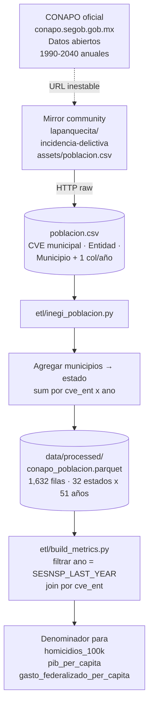

# Flujo · CONAPO (proyecciones de población)

> Sin este flujo nada de la app puede normalizar "por 100 mil
> habitantes". Es la denominación base de todas las tasas
> demográficas que aparecen en el sitio.

## Diagrama end-to-end



## Fuente

- **Oficial**: [conapo.segob.gob.mx · Datos abiertos](https://conapo.segob.gob.mx/es/CONAPO/Datos_abiertos)
- **URL que usa el ETL**:
  `https://raw.githubusercontent.com/lapanquecita/incidencia-delictiva/main/assets/poblacion.csv`
- **Por qué mirror**: la página oficial de CONAPO tiene URLs
  inestables y formato XLSX/ZIP que rota. El mirror tiene el
  mismo dato en CSV plano.
- **Cobertura**: 1990-2040 anual por municipio. Suma a 32 estados.

## Schema de entrada (mirror)

| Columna CSV | Tipo | Descripción |
|---|---|---|
| `CVE` | str | clave INEGI 5 dígitos `EEMMM` (estado + municipio) |
| `Entidad` | str | nombre del estado |
| `Municipio` | str | nombre del municipio |
| `1990` ... `2040` | int | proyección de población al 30 de junio |

## Schema del Parquet (`conapo_poblacion.parquet`)

| Columna | Tipo | Descripción |
|---|---|---|
| `cve_ent` | str | clave INEGI 2 dígitos `"01"`..`"32"` |
| `estado` | str | nombre canónico |
| `ano` | int | año 1990-2040 |
| `poblacion` | int | suma de habitantes proyectados del estado |

**Volumen**: 1,632 filas = 32 estados × 51 años.

## Decisiones clave del ETL

1. **Agregación municipal → estatal**: el archivo CONAPO viene
   por municipio (~2,400). Sumamos por `cve_ent` para tener una
   sola fila por (estado, año).
2. **Proyecciones, no censo**: estos números son **estimaciones
   demográficas** del CONAPO, no el conteo del censo 2020. Para
   2025 es la proyección oficial.
3. **El sitio usa 2025**: `build_metrics.py` lee la población
   correspondiente al último año del corte SESNSP (hoy 2025) para
   normalizar tasas.

## Cómo se usa en la app

CONAPO no aparece como métrica per se — es **denominador**. Cada
tasa "por 100k habitantes" del sitio se compone así:

```
tasa_100k = (incidencia_anual / poblacion_conapo) * 100_000
```

Esto pasa en `build_metrics.py` durante el cruce SESNSP × CONAPO.

## Cifras del sitio que dependen de CONAPO

Indirectamente todas las tasas demográficas:

- **Homicidios por 100k habitantes** (en `/mapa`, `/estado`, banner)
- **Gasto federalizado per cápita** (cuando lo calcula, divide por
  población CONAPO)
- **PIB per cápita** (lo mismo)

## Cómo verificar

```python
import pandas as pd

df = pd.read_parquet("data/processed/conapo_poblacion.parquet")

# Población de Colima 2025 (denominador de su tasa de homicidios)
col2025 = df[(df["estado"] == "Colima") & (df["ano"] == 2025)]
print(col2025)

# Total nacional 2025
print(df[df["ano"] == 2025]["poblacion"].sum())
```

Para reproducir la tasa de homicidios per cápita end-to-end ver
[el flujo SESNSP](sesnsp.md#cómo-se-construye-el-homicidios-por-100k-habitantes).

## Fallos conocidos

- **Mirror se atrasa**: si CONAPO publica una revisión nueva y el
  mirror tarda, el sitio sigue con la proyección anterior. No es
  un problema serio: las proyecciones cambian muy lentamente
  (decimales).
- **2040 es el cap**: las proyecciones oficiales llegan hasta 2040.
  Si en algún momento el ETL pide un año posterior, el join falla
  silenciosamente con `NaN` — no debería pasar mientras SESNSP
  publique con lag.
