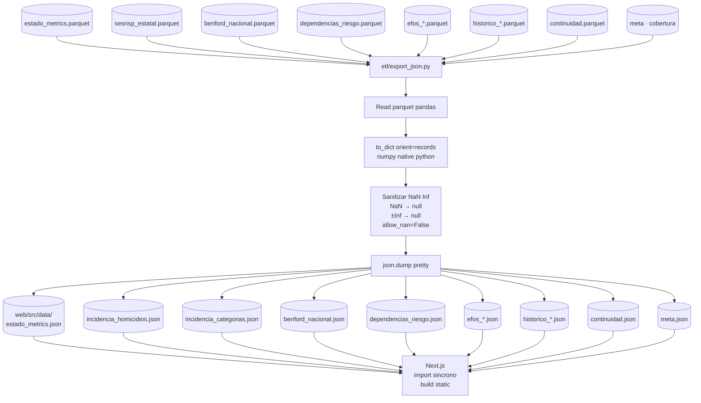

# Flujo · Export JSON (puente Parquet → frontend)

> El puente entre el store canónico (Parquet) y el frontend
> estático (Next.js). Convierte cada Parquet en un JSON
> importable sincrónicamente por TypeScript, con sanitización
> NaN/Inf incluida.

## Diagrama



## Por qué este puente existe

Next.js permite **importar JSON sincrónicamente** desde
TypeScript:

```typescript
import estadoMetrics from "@/data/estado_metrics.json";
```

Esto es **mucho más simple** que cargar Parquet con DuckDB-WASM
asíncrono, y para volúmenes pequeños es la decisión correcta.

El proyecto reserva DuckDB-WASM (cableado pero inactivo en
`lib/duckdb.ts`) para cuando el JSON deje de escalar (~5 MB).

## Outputs

| JSON | Origen | Tamaño aprox |
|---|---|---|
| `estado_metrics.json` | `estado_metrics.parquet` | ~19 KB |
| `incidencia_homicidios.json` | `sesnsp_estatal` filtrado homicidio doloso | ~196 KB |
| `incidencia_categorias.json` | `sesnsp_estatal` por subtipo | **~2.2 MB** (el más grande) |
| `benford_nacional.json` | `benford_nacional.parquet` | ~1 KB (9 filas) |
| `dependencias_riesgo.json` | `dependencias_riesgo.parquet` | ~41 KB |
| `efos_kpis.json` | KPIs computados de cruce EFOS | ~1 KB |
| `efos_top_proveedores.json` | top RFCs cruzados | ~3 KB |
| `efos_top_dependencias.json` | top dependencias con cruce | ~3 KB |
| `efos_leads.json` | top 15 leads por monto | ~9 KB |
| `efos_estatus_breakdown.json` | breakdown por estatus SAT | ~1 KB |
| `historico_anual.json` | `historico_anual.parquet` | ~3 KB |
| `historico_proveedores_top.json` | top 50 históricos | ~12 KB |
| `historico_benford_anual.json` | MAD por año | ~16 KB |
| `continuidad.json` | `continuidad.parquet` | ~14 KB |
| `meta.json` | cobertura/fechas de cada fuente | ~1 KB |

Total: ~2.6 MB. El `incidencia_categorias.json` domina por
volumen (32 × 11 × 12 × 7 = ~30k rows con 5 campos cada uno).

## Decisiones clave del ETL

1. **Sanitización NaN/Inf obligatoria**: pandas escribe `NaN`
   literal en JSON por default, lo que **rompe** `JSON.parse`
   en JavaScript. El builder usa `json.dumps(..., allow_nan=False)`
   y reemplaza NaN/Inf por `null` antes.
2. **`to_dict(orient="records")`**: emite `[{col: val}, ...]`,
   que es lo que TypeScript espera.
3. **Convertir numpy a python nativo**: `int64`, `float64`, etc.
   no serializan bien. El builder convierte con `.item()` o
   `int(x)`/`float(x)`.
4. **`meta.json` como compañero**: incluye el último año/mes
   publicado por cada fuente para que el frontend ponga labels
   precisas (`SESNSP · cierre dic 2025`) sin hardcodearlas.

## Cómo verificar

```python
import json
import pandas as pd

# Reproducir estado_metrics.json
em = pd.read_parquet("data/processed/estado_metrics.parquet")
records = em.to_dict(orient="records")

# Reemplazar NaN/Inf manualmente
import math
def sanitize(v):
    if isinstance(v, float) and (math.isnan(v) or math.isinf(v)):
        return None
    return v

records = [{k: sanitize(v) for k, v in r.items()} for r in records]
print(json.dumps(records[0], indent=2, ensure_ascii=False))

# Verificar que coincide con el JSON publicado
with open("web/src/data/estado_metrics.json") as f:
    published = json.load(f)
assert len(published) == 32
print(f"Total estados en JSON: {len(published)}")
```

## Cifras del sitio que salen indirectamente de aquí

**Todas**. Cada cifra de la UI viaja por uno de estos JSON.
Verificar contra el JSON es el último paso de cualquier
auditoría:

```javascript
// En el browser:
import data from "@/data/estado_metrics.json";
const colima = data.find(r => r.cve_ent === "06");
console.log(colima.homicidios_100k_ult12m);  // 72.61
```

## Fallos conocidos

- **JSON.parse silently rejects NaN**: por eso la sanitización
  es **estricta** (`allow_nan=False` forzaría error si quedó
  un NaN sin reemplazar). El builder se cae visible si pasa.
- **Tamaño del bundle**: el JSON de `incidencia_categorias`
  pesa 2.2 MB y se importa **sincrónicamente** en el dossier
  por estado. Cuando llegue al límite del ~5 MB, hay que migrar
  a DuckDB-WASM. El código está listo.

## Próximos pasos

- **Code-split por ruta**: `incidencia_categorias.json` solo lo
  necesita `/estado/[slug]`. Next.js debería poder
  tree-shake-arlo si solo se importa ahí, pero no se ha
  verificado el split del bundle.
- **DuckDB-WASM real**: migrar las queries más pesadas
  (`qIncidenciaSerieMensual`) a SQL sobre el Parquet remoto.
  El frontend ya tiene el wrapper en `lib/duckdb.ts`.
