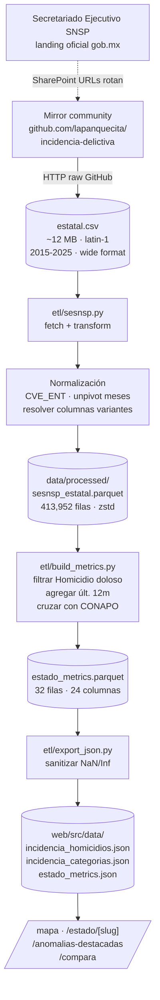

# Flujo · SESNSP (incidencia delictiva)

> Cada homicidio, robo, secuestro y feminicidio que aparece en el
> mapa, en los dossieres estatales y en los KPIs del sitio sale
> de este pipeline.

## Diagrama end-to-end



## Fuente

- **Oficial**: [gob.mx · SESNSP datos abiertos](https://www.gob.mx/sesnsp/acciones-y-programas/datos-abiertos-de-incidencia-delictiva)
- **URL que usa el ETL**:
  `https://raw.githubusercontent.com/lapanquecita/incidencia-delictiva/main/data/estatal.csv`
- **Por qué el mirror**: SESNSP migró a SharePoint con URLs
  efímeras desde 2024. El mirror community
  `lapanquecita/incidencia-delictiva` sincroniza el CSV oficial
  mensualmente y es **el mismo dataset** que publica gob.mx (verificado
  contra el archivo `datos.gob.mx · id=incidencia_delictiva`).
- **Cobertura actual** (verificada 2026-05-06): hechos delictivos
  ocurridos entre 2015 y diciembre de 2025. SESNSP no ha publicado
  2026 todavía (lag típico ~5 meses).

## Schema del CSV original

El CSV viene en formato **wide**: una fila por (Año × Estado × Bien
jurídico × Tipo × Subtipo × Modalidad) y **12 columnas mensuales**
con los totales.

| Columna CSV | Tipo | Notas |
|---|---|---|
| `Año` | int | 2015-2025 |
| `Entidad` | str | nombre del estado con variantes (acentos, abreviaturas) |
| `Bien jurídico afectado` | str | "La vida y la integridad corporal", etc. |
| `Tipo de delito` | str | "Homicidio", "Lesiones", "Robo", etc. |
| `Subtipo de delito` | str | "Homicidio doloso" o "Homicidio culposo" |
| `Modalidad` | str | submodalidad fina |
| `Enero` ... `Diciembre` | int | conteo mensual |

## Schema del Parquet de salida (`sesnsp_estatal.parquet`)

El ETL **desarma el wide a long** (un row por mes) y normaliza la
clave geográfica:

| Columna | Tipo | Descripción |
|---|---|---|
| `cve_ent` | str | clave INEGI `"01"` a `"32"` |
| `estado` | str | nombre canónico |
| `ano` | int | año |
| `mes` | int | 1..12 |
| `bien_juridico` | str | conservado para futuros agregados |
| `tipo_delito` | str | |
| `subtipo` | str | usado para filtrar "Homicidio doloso" |
| `modalidad` | str | |
| `total` | int | hechos del mes |

**Volumen**: 413,952 filas para 2015-2025.

## Decisiones clave del ETL

1. **Mirror community como primario**: prioriza disponibilidad
   sobre origen oficial directo. Se documenta la cadena de
   custodia (gob.mx → community mirror → este pipeline) en el
   código.
2. **Encoding `latin-1`**: el CSV oficial mexicano usa latin-1.
   El ETL prueba latin-1 → utf-8 → cp1252 en cascada.
3. **`coalesce_columns()` para columnas variantes**: SESNSP
   ocasionalmente renombra columnas. El script resuelve por
   patrones canónicos (`"Año"`, `"Ano"`, `"Year"`) y si **no
   encuentra** lo necesario falla ruidosamente — preferimos
   romper a publicar números equivocados.
4. **Normalización a `cve_ent`**: el nombre del estado en el CSV
   tiene variantes (`"México"`, `"Estado de México"`, `"Edo. Mex."`).
   `common.to_cve_ent()` los resuelve a `"15"`.
5. **Reportar `unresolved`**: si algún estado no resuelve, el ETL
   loguea la lista. Ningún row se descarta silenciosamente.

## Cómo se construye el "Homicidios por 100k habitantes"

Este es el indicador estrella del sitio. Sale en `/mapa`,
`/estado/[slug]`, `/anomalias-destacadas` y `/compara`.

1. **Filtrar `subtipo = "Homicidio doloso"`** en
   `sesnsp_estatal.parquet`.
2. **Agregar últimos 12 meses publicados** (período rodante hasta
   `SESNSP_LAST_PERIOD`, hoy diciembre 2025) por `cve_ent`.
3. **Normalizar por población**: dividir el total entre la
   población proyectada CONAPO 2025 del estado y multiplicar por
   100,000. Ver el flujo [CONAPO](conapo.md) para la fuente de
   la población.
4. **Computar percentil de riesgo**: ordenar los 32 estados de
   menor a mayor tasa y mapear su posición al rango 0-100.

Producto: columna `homicidios_100k_ult12m` en `estado_metrics.parquet`.

## Cifras live del sitio que salen de este flujo

| Cifra | Dónde aparece | Hallazgo correspondiente |
|---|---|---|
| **Colima 72.6 hom/100k** (#1 nacional) | `/mapa`, `/estado/colima`, banner home | `colima-violencia-gasto` |
| **Sinaloa +68.3% YoY** | `/mapa` (métrica Δ YoY), banner home | `sinaloa-yoy` |
| **Yucatán 1.39/100k** (#32, el más bajo) | `/mapa`, `/estado/yucatan`, banner home | `yucatan-mas-seguro` |
| **413,952 registros** | `/fuentes`, README | (volumen del corpus) |

## Cómo verificar una cifra

```python
import pandas as pd

df = pd.read_parquet("data/processed/sesnsp_estatal.parquet")

# Total homicidios dolosos en Colima 2025
col2025 = df[
    (df["estado"] == "Colima") &
    (df["subtipo"] == "Homicidio doloso") &
    (df["ano"] == 2025)
]["total"].sum()
print(f"Homicidios Colima 2025: {col2025}")

# Cualquier estado, cualquier delito
estado = df[df["cve_ent"] == "06"]
print(estado["subtipo"].unique())
```

Para reproducir el **`homicidios_100k_ult12m`** que sale en la UI:

```python
em = pd.read_parquet("data/processed/estado_metrics.parquet")
print(em[["estado", "homicidios_100k_ult12m", "cambio_yoy"]].sort_values(
    "homicidios_100k_ult12m", ascending=False
).head(5))
```

## Fallos conocidos y mitigaciones

- **SESNSP cambia esquema**: el script falla con mensaje claro
  nombrando las columnas detectadas. Actualizar las listas
  `coalesce_columns` en `etl/sesnsp.py`.
- **Mirror se atrasa**: si el mirror community no incorporó la
  última publicación, descargar el CSV oficial manualmente y
  guardarlo en `data/raw/sesnsp_estatal.csv`. El script lo
  detecta y lo usa.
- **2026 no disponible**: SESNSP publica con lag ~5 meses. Hasta
  que el mirror tenga 2026, el sitio mostrará cierre a diciembre
  2025.

## Próximos pasos en el roadmap

- **V7 · municipal**: integrar el dataset IDEFM (municipal) de
  SESNSP. ~2,400 municipios con la misma estructura wide.
  Cambio: agregar columna `cve_mun` al schema; la transformación
  reusa la misma lógica.
- **V2 · víctimas**: integrar el dataset IDVFC. Schema distinto
  (incluye sexo, edad, modalidad). Permite cruces tipo "% de
  víctimas mujeres por estado" — requiere un nuevo agregado.
